# From Scratch
A collection of Machine Learning algorithms implemented in Python from scratch targeting in minimal and clean code.

## Motivation
Transforming an algorithm from math equations to code is a sometimes difficult but always fruitful journey every 
Data Scientist should take at least once. The goal of this project is to go down to the last detail of each
algorithm, fill the gap between math and code, demystify ML models complexity and revisit their 
mathematical background.


## Implementations
- Supervised Learning
    - Multi-layer Neural Networks [[demo]](./examples/supervised/backpropagation.ipynb) [[code]](./fromscratch/supervised/neuralnetworks)
    - Classification Trees [[demo]](./examples/supervised/classification-tree.ipynb) [[code]](./fromscratch/supervised/classification_tree.py)
    - Adaptive Boosting [[demo]](./examples/supervised/adaboost.ipynb) [[code]](./fromscratch/supervised/adaboost.py)
    - Support Vector Machine [[demo]](./examples/supervised/svm-classifier.ipynb) [[code]](./fromscratch/supervised/svm_classifier.py)
    - Linear Regression [[demo]](./examples/supervised/linear-regression.ipynb) [[code]](./fromscratch/supervised/linear_regression.py)

- Unsupervised Learning
    - K-means [[demo]](./examples/unsupervised/kmeans.ipynb) [[code]](./fromscratch/unsupervised/kmeans.py)
    - DBSCAN [[demo]](./examples/unsupervised/dbscan.ipynb) [[code]](./fromscratch/unsupervised/dbscan.py)
    - Principal Component Analysis (PCA) [[demo]](./examples/unsupervised/pca.ipynb) [[code]](./fromscratch/unsupervised/pca.py)

- Reinforcement Learning
    - N-armed Bandits [[demo]](./examples/rl/n-armed-bandit.ipynb) [[code]](./fromscratch/rl/bandit.py)
    - Dynamic Programming [[demo]](./examples/rl/policy-iteration.ipynb) [[code]](./fromscratch/rl/dp.py)
    - SARSA [[demo]](./examples/rl/temporal-difference-learning.ipynb) [[code]](./fromscratch/rl/td_learning.py)
    - Q-Learning [[demo]](./examples/rl/temporal-difference-learning.ipynb) [[code]](./fromscratch/rl/td_learning.py)

## Dependencies
- **numpy**: Used in all implementations for vector/matrix operations and vectorized calculations
- **cvxopt**: Used in SVM for solving the quadratic programming problem
- **scipy**: Borrowed its KDTree implementation for fast nearest neighbours calculation

## Demos
Each algorithm is accompanied with a notebook with
mathematical background, application of the methodology
on toy datasets and intuitive visualizations.

### Supervised Learning
#### Multi-layer Neural Networks

```
Fead-forward Neural Network
---------------------------
4 layers: [10, 10, 10, 1]

       Inputs
       \ | /
 o o o o o o o o o o 
       \ | /
 o o o o o o o o o o 
       \ | /
 o o o o o o o o o o 
          | 
          o 
       Outputs
```

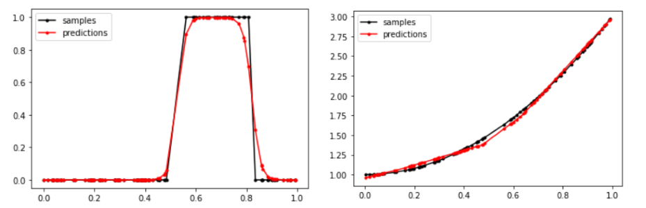

#### Classification Trees
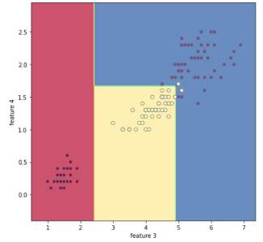
```
{'expr': 'feature_2 <= 2.45',
 'no': {'expr': 'feature_3 <= 1.75',
        'no': {'expr': 'feature_2 <= 4.85',
               'no': {'label': 2.0},
               'yes': {'label': 2.0}},
        'yes': {'expr': 'feature_2 <= 4.95',
                'no': {'label': 2.0},
                'yes': {'label': 1.0}}},
 'yes': {'expr': 'feature_0 <= 4.35',
         'no': {'expr': 'feature_0 <= 4.45',
                'no': {'label': 0.0},
                'yes': {'label': 0.0}},
         'yes': {'label': 0.0}}}
```

#### Support Vector Machine
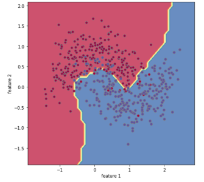

#### Linear Regression
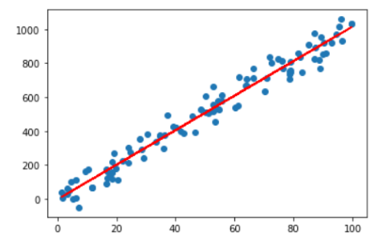


### Unsupervised Learning
#### K-means
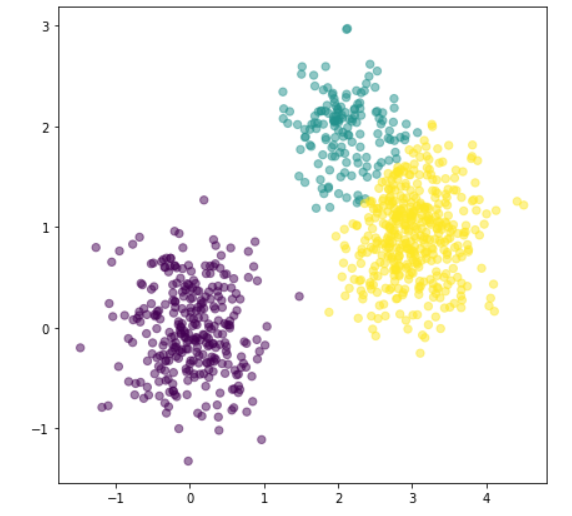

#### DBSCAN
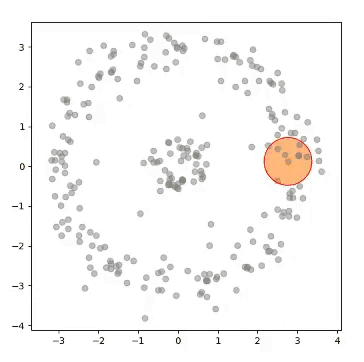

#### Principal Component Analysis (PCA)
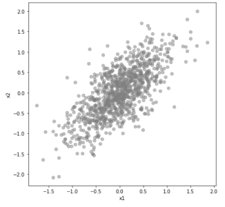 

### Reinforcement Learning
#### N-armed Bandits
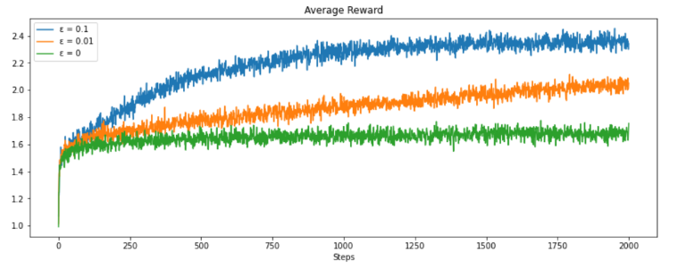


#### Dynamic Programming
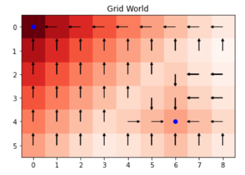

#### Q-Learning
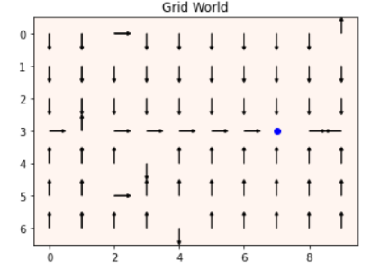 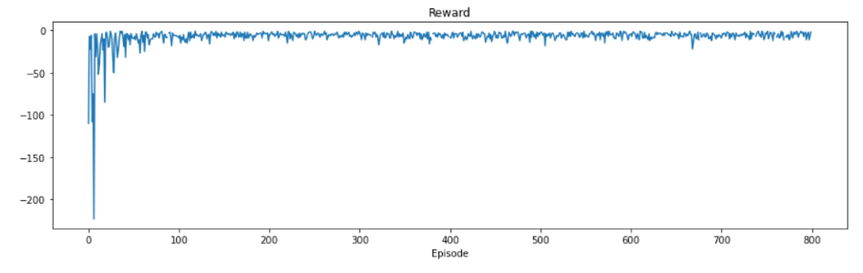


#### SARSA
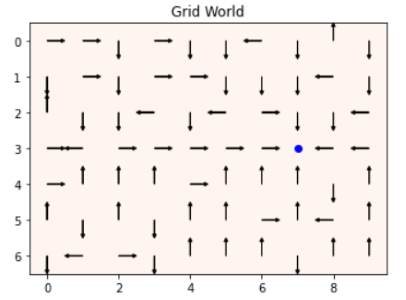 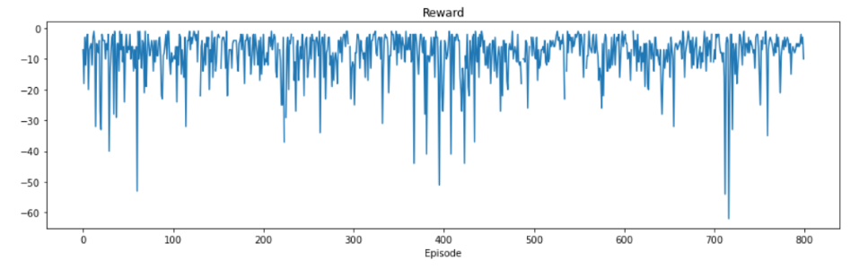
